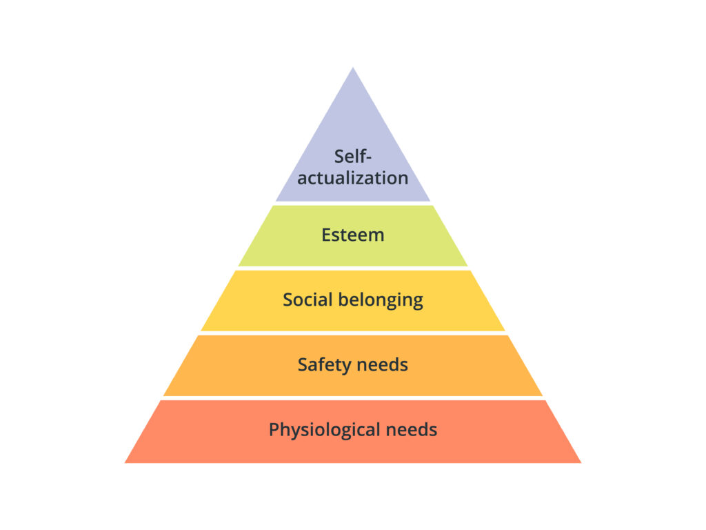

Mutual Thriving offers a practical framework to help you navigate life in a way that maximizes win/win dynamics between you and others.

We argue that a life according to the mutual thriving principles can represent not only a morally good life, but a better way to live even from the old paradigm's perspective.

This website offers the theory as well as practical support on how you can integrate win/win dynamics into your life and social environment.

The goal is to offer a meaningful and attractive new way of living that is
* mutually beneficial
* generalizable within planetary boundaries
* compatible with life in our current system.

Mutual Thriving as an organization coordinates the knowledge exchange between communities around the world, to help new ones establish more easily.

Our vision is a paradigm shift on a civilizational level, from a game-theoretic (win/lose) world view to one that actually works, too, but has the flourishing of all in its mind, starting with yourself.

## Motivation

Our current system is misaligned:

- Our current global society is failing to mitigate existential risk. Rather, we are racing towards catastrophe (AI arms race, climate crisis, etc.)
- **Despite living in historically unmatched wealth, individuals of the Western World are getting more depressed and anxious than ever before.**

How can we steer society into a more aligned direction? We argue

1. We need a shift on a paradigmatic level.
2. We will have to do it bottom-up, because top-down change is currently not expectable.

Let's look into the argumentation in more detail.

### Wanted: Paradigm Shift

Parameter changes (like making machines or processes more efficient) and even new goals (like the Sustainable Development Goals) are not enough if the underlying paradigm stays misaligned ([Donnella Meadows: Levers of change](https://donellameadows.org/archives/leverage-points-places-to-intervene-in-a-system/)). We need change at a paradigmatic level: How we view the world, how we view ourselves in relationship with the world, what we value in ourselves and others.

<strong>Longer argumentation</strong>

There are plenty of well-intended efforts to make our society more sustainable and better for all. Why do they not seem to suffice?

**We need a shift on a paradigmatic level**: If a company finds a way to cut the resources needed to produce a good in half, they will likely not end up using fewer resources. Rather, they may end up producing double the amount of goods. Why does that happen? An answer is proposed by [systems theory pioneer Donnella Meadows](https://donellameadows.org/archives/leverage-points-places-to-intervene-in-a-system/): Parameter optimization within a system is a weak leverage point to change the system as a whole. Sustainability goals are better, but they might be circumvented if they stand against fundamental incentives of a company or society. *Behavior in the system flows downstream from the system's paradigm*. When we want to steer our system towards alignment, we need to understand what paradigm underlies our system, which aspects of it lead to the observable misalignment, propose changes and then find a way to actually shift the system accordingly.

**What is a paradigm?** The dominant societal paradigm describes how we view the world, how we view ourselves in relationship with the world, what we value in ourselves and others. "What makes a society succesful?" (Even the notion of "states" or "nations" is downstream of a paradigm in which societies are clustered into nations.) "What makes a good life?" - Answering question like these can give you a sense of the paradigm underlying our system.

**What is problematic within our current paradigm?**

Looking at our dominant economic system of the west, we make a set of assumptions about our system's underlying paradigm:

- The success of a Nation is typically measured in economic size and growth.
- Individual success is represented by the individual's ranking along well-regarded measurable metrics. The most universal success metric across society is financial wealth.
- Mainstream recognition (status) for individuals is awarded on the basis of success metrics.
- The boundaries within which players are free to pursue their success are set by rules and laws.
- The non-human environment represents resources that can be used to support one's pursuit of success (as long as you stay within legal boundaries).

What parts are problematic and in which way?

Social Philosopher [Daniel Schmachtenberger identifies two core issues](https://civilizationemerging.com/solving-generator-function/) that, mixed with exponential technological progress, sooner or later lead to global catastrophe:

1. **Rivalrous dynamics (Win/Lose Thinking)**: If we assume that in order to "win" in life or business, others may or must lose, harm is unavoidable. Rivalrous dynamics produce multiple phenomena that are in the center of our current global problems:
    1. *Externalization of cost*: In our system, players can make private gains at the cost of the public: If businesses make profits off of people's addictions and they have the tools and legal frame to make them addicted, they are incentivized to do so: Take smoking, alcohol, gambling, sugary foods and drinks, where fortunes can be made at the cost of people's long-term quality of life. Systematic incentive is clearly decoupled from what would maximally benefit the collective. Apart from human suffering, take the exploitation of animals or the exploitation and pollution of our natural environment: As soon as the damage caused is not explicitly forbidden or priced into production cost, players are incentivized to condone them.
    2. *Multi-Polar Traps* (aka tragedy of the commons): A particularly noteworthy phenomenon in competitive win/lose dynamics is multi-polar traps: If you can build a nuclear weapon, you might realize it's a risky idea and not pursue it. However, if you fear that others will build a nuclear weapon and use it against you if you do not go there first, it is even riskier for you *not* to build it. Multi-polar traps describe how win/lose competition incentivizes players to take actions that they know can harm the system as a whole: They may not even be happy about, but fear that if they don't take the shot, competitors will still take it and gain a significant advantage over them. This is why developments in artificial intelligence are exploding in an unchecked way, even though stakeholders are aware of the risks connected to superhuman AI. Multi-polar traps also explain why climate change is so hard to address if climate-friendly action comes at a competitive disadvantage.
2. **Destroying the self-repairing capacity of systems we depend on:** Humans depend greatly on oxygen, non-toxic air, clean drinking water and other factors from the ecosystem we're embedded in. Underneath these factors lie systemic regenerative closed-loop processes in nature. Weakening the self-regulating capacity of nature, by extracting resources and destroying ecosystems, makes the macro-ecosystem we depend on increasingly fragile. However, our systemic paradigm and win/lose dynamics incentivize us to accept environmental damage, while technological progress makes the damage we can deal evermore significant.

If we keep advancing technology but do not shift our paradigm in a way that addresses these core issues, catastrophe is unavoidable. So, if we want to make a change, the quest is to find a new paradigm that works, results in public benefit downstream, stays within planetary boundaries and makes societal self-termination unlikely.

**Win/Lose thinking to win/win thinking:** Simply put, the most important shift to accomplish is a transition from win/lose thinking to win/win thinking: Away from the game-theoretic modeling of our world as a zero-sum game (winning means that others must lose) rooted in the assumption of general scarcity towards a mindset of abundance, with the world view that our own thriving and that of others are compatible - in many cases even in a symbiotic relationship with each other.

### We cannot rely on Top-Down change

Oftentimes, people wonder in frustration why governments do not take sufficient action towards sustainability. We argue that this is a predictable behavior in the competitive landscape downstream of a win/lose paradigm: Governments are trapped in a global competition for wealth and political power. Sustainable measures like lowering Greenhouse Gas emissions are a classic multi-polar trap, where win/lose assumptions incentivize any player to prioritize short-term gains over long-term sustainability.

There is no global top-down entity that would set rules *and* have the executive power to make all players stick to them. Hence, we cannot currently rely on top-down change within the current paradigm.

**Actionable Bottom-up change**

Instead, we need a **bottom up approach that is actionable.** Start with a local community who successfully implements the new paradigm, attract new members so that the community becomes a movement and reach a critical mass, so that culture shift can happen. If this can happen in many places around the world in short time, the culture shift can reach a global level in reasonable time. The goal for *Mutual Thriving* as an organization, therefore, shall be

1. The creation of a template according to which local initiators can start a win/win paradigm community, successfully implement it locally, in a way that attracts new members and can grow to a local movement.
2. The coordination of decentralized movements into one overarching movement, including (but not limited to) the transfer of ideas and learnings between communities and the sharing of digital infrastructure.

### Premise: Human Culture is very malleable

The human mind is very malleable. Human culture is very malleable. Looking at different geographical locations or history, you find that there can exist cultures with patriarchy, cultures with matriarchy, cultures with strong religious dogma, cultures that are mostly secular. Humans have an outstanding capability to adapt to their environment, also culture-wise. Historically, modern technology puts us in a unique position where (at least [food-wise](https://www.nature.com/articles/s41893-019-0465-1)), we do live in a world of sustainable abundance to feed every human individual. **This gives reason to think that a culture based on a win/win paradigm, once established, can successfully exist.**

**Consideration: Game-theoretic stability**

An important aspect to consider is that if a win/win culture is built from the bottom up, it will be embedded into an ecosytem of (game-theoretic) win/lose thinking. A successful win/win culture needs to account for attempts of exploitation from the outside. History shows plenty examples where peaceful cultures ended up being exploited by more exploitative cultures. Also, we should expect selfish action within our community and account for that. Ideally, win/win behavior is preferable not only from a moral standpoint but also from a selfish perspective.

In the following section, we present the mutual thriving paradigm. It is our proposal how to take all aforementioned requirements and considerations into account, in a way that can be briefly communicated and be remembered in practice.

---

## Vision: Mutual Thriving Paradigm

Most simply put, the mutual thriving paradigm represents a culture framework to answer the following question:

> "How can I live a life that's good for me *and* good for others?"

We believe that a world worth striving for fulfills the following criteria

1. It allows us to thrive as individuals: Have our basic needs met, foster inter-personal relationships, find pleasure in life and self-actualize.
2. Our individual actions, as well as our collective actions, are compatible with the flourishing of others.
3. Our individual actions, as well as our collective actions, are compatible with the flourishing of future generations.

That's it!

If we can agree on these three criteria as core criteria for a successful civilization, we have a established a framework for a win/win culture.

### Nomenclature

**Thrive:** We understand *thriving* as moving upwards (by having all layers below satisfied) on Maslow's pyramid of needs:

    

**Others:** We understand *others* as the moral circle you are currently considering. Depending on practical possibility and relevance, it may be smaller or larger at a given point in time. Given the practical capacity, it shall be our goal to expand our moral circle as far as possible, from our global human family to animals and all sentient beings.

### Community Values

- Acknowledge (current) biological and psychological realities: It shall be our goal to see things as they currently are, not what we would wish they were.
- **Embrace effort & boredom if it leads to bottom-line fulfillment.**
    - Be wary of instant gratification, hyper-stimulation and addiction.
- Seek and take action to thrive personally (It is my right to seek my thriving): Health, Relationships, Economic Safety, connectedness... It is not required, not the goal, and not even virtuous to sacrifice your own well-being for the sake of others. Rather, a successful mutual thriver is skillful in their capacity to thrive in a way that's also good for others.
- If your basic pyramid is met, look outwards for ways to provide value to society.

### Opportunity

The presented criteria and values as the guidelines for our actions open a vast action space: A lot is possible, a lot is worth discussing. The framework is intentionally limited to core guidelines, in order to foster ideation and discourse about what can be derived from here.

---

## How to be a Thriver

On an individual level, how can you foster the mutual thriving paradigm in your own life? Being a thriver is a skill to be honed. You do it by looking at choices and activities in your life and scrutinizing them with the following 3 decision criteria:

### Personal Decision Criteria

1. **(How) Does it help me thrive?**
    - No moral obligation to do things that significantly hurt your thriving.
2. **(How) Does it help others thrive, or be at least invariant to other people's thriving?**
3. **Is it (sustainably) generalizable? How could I make it that?**
    - *Generalizable* means: Could what you do get adopted by basically anyone on the planet without putting the thriving of future generations at risk? Think planetary boundaries and second order consequences.

Choose action with 3 YESes. If you have found actions with 3 YESes, you can have high confidence that your action lies within the mutual thriving criteria. Congratulations, you have found a mutual thriving format!

Award recognition for 3-YES actions to others. Social conditioning is perhaps the strongest lever we have to steer people's behavior into new directions.

### Gathering Mutual Thriving Formats

How to get started? Instead of getting stuck in debating edge cases, **identify and collect action opportunities where all 3 Decision Criteria can be answered with a clear YES.**

Reward people who implement opportunities with societal recognition.

Promising topics:

1. Creating an environment that passively supports biological well-being (good air quality, healthy lighting, etc.)
2. Enable yourself and others to navigate daily life without falling victim to addictive, bottom-line self-harming behaviors.
3. Create a community that shares the Mutual Thriving paradigm.
4. Create housing environments that reduce resource need on a day to day basis.
5. Make human connection and intimacy abundant

---

## Cultural Transition

The goal of the Mutual Thriving Movement is to spark a cultural transition from our current societal paradigm to one of mutual thriving. The most promising way for this is via distributed grassroot communities who grow into collectively large enough share of the population to impact mainstream culture. How can this be achieved?

### How to create Mutual Thriving (MT) Culture

How can you contribute to building Mutual Thriving Culture?
Build or join a community and follow these three steps:

1. Implement community formats that align with the MT guidelines.
2. Award recognition within your community based on people's ability to flourish in alignment within the MT guidelines. For example:
    1. The ability to find happiness & self-actualization with little resources (meditation, sports, time with friends).
    2. Doing stuff for the community in a way that makes you happy.
3. Make the community appealing to people who are not yet members. This is what the following section is about.

### A better way to live

Do you want to be a burned-out, obese person with bad social relationships but a lot of wealth?

There is good data that, beyond a certain point, increased wealth delivers diminishing returns on individual quality of life. Yet, the current cultural paradigm reinforces people to pursue wealth as their primary success metric. This is a problem. And an opportunity.

What if you could be part of a culture that lets you keep the good parts of your life but reinforces you to pursue things that actually make you more fulfilled? In a way that even elevates your status before members of the old cultural paradigm? This is what we should aim for.

> *Culture change happens when a group of people has found a better way to live.*

**Foster expressions of the mutual thriving paradigm that are beneficial from the perspective of the current cultural paradigm:**

- Improve financial freedom
- Improve individual health & well-being
- Improve body aesthetics
- Improve intimacy & sexual abundance

These gains are totally attainable in a mutually beneficial way - you just need to be creative. Think of going for walks with friends instead of drinks - save money, improve health. Think of car- or utility-sharing networks with friends - save money. Think of community mealprep sessions - save money, eat healthy, meet people in person.
